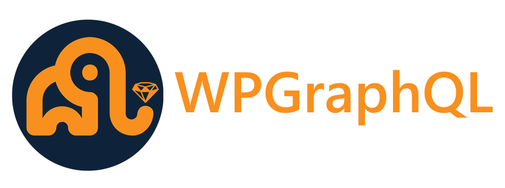

## NexPress

The NexPress is a web application that combines the power of Next.js, and Headless WordPress to provide a robust and feature-rich experience. The application leverages the benefits of server-side rendering and the flexibility of WordPress as a backend CMS to create a fast and dynamic websites.

## Technologies Used

The project utilizes the following technologies:

#### Next.js:

Next.js is a popular React framework that enables server-side rendering and provides an efficient development environment for building scalable web applications.

#### Headless WordPress:

WordPress, a widely adopted content management system, is used as the backend for this project. In a headless setup, WordPress is used solely as a data source, providing content via a RESTful API or a GraphQL API(We are using Graphql).

#### WP-GraphQL:

WP-GraphQL is a WordPress plugin that extends the default WordPress REST API with GraphQL support. It enables querying data from WordPress using GraphQL syntax, allowing for efficient and flexible data retrieval and manipulation.

# Getting Started

To get started with the NexPress, follow these steps:

- Clone the repository: git clone https://github.com/garydubb/Nexpress.git
- Install dependencies: npm install or yarn
- Configure environment variables: Create a .env file based on the provided .env.example file and update the necessary values.
- Start the development server: npm run dev or yarn run dev
## Configuration

### Step 1. Prepare your WordPress site

First, you need a WordPress site.

Once the site is ready, you'll need to install the [WPGraphQL](https://www.wpgraphql.com/) plugin. It will add GraphQL API to your WordPress site, which we'll use to query the posts, products, settings and so on. Follow these steps to install it:

- Download the [WPGraphQL repo](https://github.com/wp-graphql/wp-graphql) as a ZIP archive. Install & activate
- Download the [WooGraphql plugin] () as a zip archieve. Install and activate.

#### GraphiQL

The [WPGraphQL](https://www.wpgraphql.com/) plugin also gives you access to a GraphQL IDE directly from your WordPress Admin, allowing you to inspect and play around with the GraphQL API.

### Step 2. Populate Content

Inside your WordPress admin, go to **Posts** and start adding new posts:

- We recommend creating at least **2 posts**
- Use dummy data for the content
- Pick an author from your WordPress users
- Add a **Featured Image**. You can download one from [Unsplash](https://unsplash.com/)
- Fill the **Excerpt** field

When you’re done, make sure to **Publish** the posts.

# Environment Variables:
Rename .env.example to .env.local and update the variables to match your WordPress setup.

## NEXT_PUBLIC_GRAPHQL_URL : 

Description: This variable specifies the GraphQL endpoint URL of the WordPress backend.

Value: http://example.com/graphql (example value)

Usage: This URL is used by the Next.js application to communicate with the WordPress backend via GraphQL queries and mutations.

## WORDPRESS_AUTH_REFRESH_TOKEN

Description: This variable contains the refresh token used for authenticating with the WordPress backend.

Value: abcccc use this link to create token[LINK] (https://api.wordpress.org/secret-key/1.1/salt/)

Usage: The refresh token is utilized for authenticating requests to the WordPress backend, particularly for operations requiring authorization, such as fetching private data or performing mutations.
